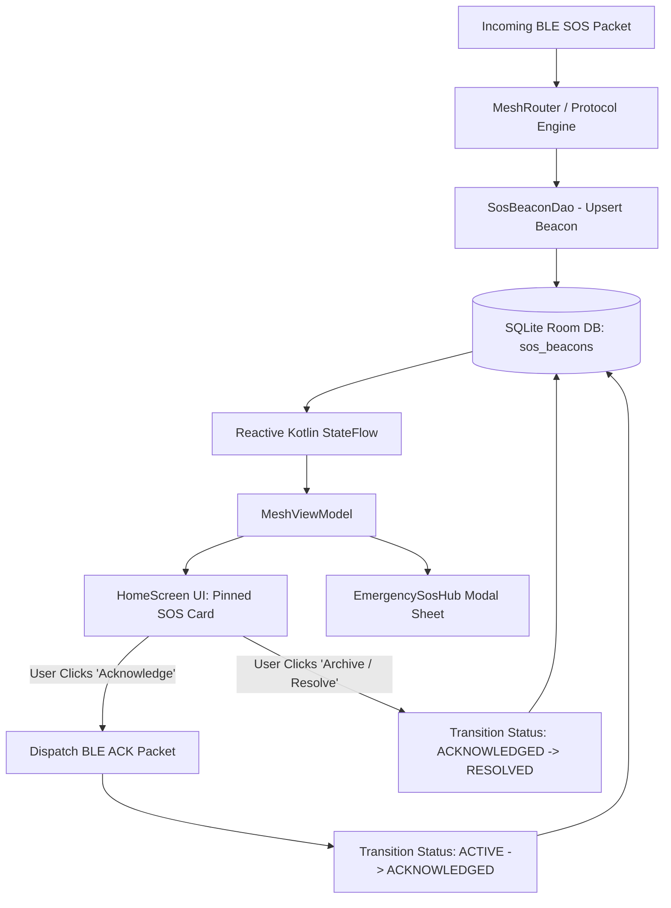

# Ripple Project Status & Architecture Report

**Status Date:** September 2026  
**Target Platforms:** Android (Kotlin, Jetpack Compose, Room, Hilt) & iOS (Swift, SwiftUI, SwiftData, CoreBluetooth)  
**Report Focus:** Emergency SOS Hub Completion, iOS Parity Status, and Upcoming Profile & Settings Architecture

---

## Executive Summary

This report provides a comprehensive technical update on the latest milestone deliverables for **Ripple**, the decentralized, off-grid Bluetooth Low Energy (BLE) mesh communications platform. 

1. **Delivered Milestone (Android)**: The **Emergency SOS Hub & Priority Incident Management System** has been fully implemented, integrated with the BLE mesh transport, verified in the local SQLite/Room database, and tested live across physical hardware devices.
2. **Current iOS Status**: Cross-platform cryptographic pairing and QR verification are complete. Staged architecture and schemas are prepared for the Emergency SOS Hub, slide-to-reply gestures, and message thread handling pending final hardware testing on the macOS development environment.
3. **Upcoming Architectural Phase**: A unified **Profile & Identity System** alongside a modernized, line-by-line **Settings Management Hub** is outlined for the next development cycle.

---

## 1. Completed Milestone: Emergency SOS Hub & Incident Management

The Emergency SOS system has been upgraded from a basic broadcast trigger into a robust, high-reliability emergency management system capable of handling active triage, thread branching, acknowledgments, and resolution lifecycles in disaster or off-grid scenarios.

```
+-----------------------------------------------------------------------------------+
|                              RIPPLE HOME SCREEN                                   |
+-----------------------------------------------------------------------------------+
|  [!] 2 Active Emergencies                  [ View All (2) ]  <- Collapsible Banner|
+-----------------------------------------------------------------------------------+
|  +-----------------------------------------------------------------------------+  |
|  | (A) EMERGENCY SOS BEACON                        [ VERIFIED ] 4:51 pm        |  |
|  | From: Asha (7225-8226-8c87-4656) · 1 hop away                               |  |
|  | "Injured hiker with severe ankle sprain near North Trail marker 4."        |  |
|  | Location: 37.7749° N, 122.4194° W (+-15m)                                    |  |
|  |                                                                             |  |
|  | [ Open Map ]             [ Open Thread ]            [ Acknowledge (ACK) ]   |  |
|  +-----------------------------------------------------------------------------+  |
+-----------------------------------------------------------------------------------+
|  CHATS TAB                    | PEERS TAB (6)                                     |
|  - Tablet                     | - Rip (Online)                                    |
|  - Everyone nearby            | - Asha (1 hop)                                    |
+-----------------------------------------------------------------------------------+
```

### Key Capabilities & Technical Details

#### 1. Priority Pinned Inbox Placement
* **Unconditional Top Visibility**: Regardless of how active regular peer chats are, active SOS emergency beacons remain permanently pinned to the top of the user's Inbox until acknowledged or resolved.
* **Master Collapsible Banner ($\ge 2$ Beacons)**: When multiple emergencies are broadcast simultaneously across the mesh network, the UI automatically consolidates them into a clean top banner (`🚨 Active Emergencies (N)`) with a `View All` action, preventing Inbox clutter while maintaining immediate access.

#### 2. Comprehensive Triage Card
Each emergency card surfaces critical rescue telemetry directly on the surface:
* **Sender Identity & Cryptographic Badge**: Node ID, display handle, and verification pill (`VERIFIED` vs `UNVERIFIED`).
* **Relay Proximity**: Real-time hop distance calculation (`Direct link`, `1 hop`, `2+ hops`).
* **Emergency Payload**: Full incident description text broadcasted over the radio.
* **Geospatial Telemetry**: Accurate GPS coordinates (Latitude/Longitude) with an embedded `Open Map` trigger to launch native offline or online mapping providers.

#### 3. Incident Thread Navigation (`Open Thread`)
* Tapping **Open Thread** immediately branches into a dedicated, high-priority mesh chat thread scoped to the emergency incident.
* Allows search and rescue patrollers, team members, or nearby civilians to coordinate medical supplies, rescue ETAs, and evacuation plans without polluting standard broadcast channels.

#### 4. Rescue Acknowledgment Protocol (`Acknowledge / ACK`)
* Tapping **Acknowledge** dispatches an immediate cryptographic ACK packet across the BLE mesh back to the sender.
* Informs the distressed party that help is on the way and updates the local beacon status to `ACKNOWLEDGED`.

#### 5. Archiving & Resolution Lifecycle
* Beacons can be marked as `RESOLVED` once an emergency is cleared.
* Resolved beacons are automatically moved to the incident archive, clearing the active HomeScreen banner while retaining full incident logs for post-operation debriefs.

### Database Architecture & Data Flow



* **Table Definition (`sos_beacons`)**:
  * `id: String` (Primary Key, deterministic packet hash)
  * `senderId: String`, `senderName: String`
  * `message: String`, `timestamp: Long`
  * `latitude: Double?`, `longitude: Double?`
  * `status: SosStatus` (`ACTIVE`, `ACKNOWLEDGED`, `RESOLVED`)
  * `isVerified: Boolean`
* **Query Performance**: Indexing on `status` and `timestamp` guarantees sub-millisecond retrieval times ($O(\log N)$).

---

## 2. Future Architecture & Next Phase: Profile & Modernized Settings

To ensure Ripple scales from an emergency utility into a seamless, modern communication tool, the next planned engineering sprint will focus on separating identity configuration from hardware settings.

```
+-----------------------------------+        +-----------------------------------+
|             SETTINGS              |        |        PROFILE & IDENTITY         |
+-----------------------------------+        +-----------------------------------+
|  [👨‍🚀] John Doe                   |        |             [ 👨‍🚀 ]               |
|      Tap to edit profile & id >   |------->|           (Change Avatar)         |
|-----------------------------------|        |-----------------------------------|
|  🎨 Appearance & Themes          >|        |  Display Name: [ John Doe       ] |
|  ⚡ Power & Relay Profile        >|        |  Node ID: 4fa3-b248-86ba-1002    |
|  🔐 Pairing & Safety Numbers     >|        |  [ 📋 Copy ]      [ 📱 Show QR ]  |
|  💾 Identity Backup & Restore    >|        |-----------------------------------|
|  📊 Diagnostics & Radio Logs     >|        |  Cryptographic Hardware Keystore  |
|  📡 Field Test Tool              >|        |  Key Type: Ed25519 / P-256 (64B)  |
|  🗑️ Reset Local Database         >|        |  Status: Hardware Bound (TEE)     |
+-----------------------------------+        +-----------------------------------+
```

### 1. Modern Line-by-Line Settings Hub
* **Decluttered Visual Structure**: Moving away from complex mixed cards to a clean, high-contrast, line-by-line configuration interface inspired by Android and iOS system settings.
* **Clear Categorization**:
  1. **Profile Navigation Card**: Prominent top row featuring the user's active avatar, name, and Node ID with a direct chevron transition to the profile editor.
  2. **Appearance & Visual Themes**: Dark/Light mode switching and high-contrast color palettes.
  3. **Power & Relay Profile**: Power management presets (Balanced, Low Power Battery Saver, High-Throughput Aggressive Relay).
  4. **Security & Cryptography**: Safety number verification, contact QR scanning, and military-grade encrypted identity backup/restore (PBKDF2-HMAC-SHA256 + AES-256-GCM).
  5. **Radio Engineering & Diagnostics**: Real-time packet throughput graph, BLE radio logs, and field test RF spectrum analyzer.
  6. **Data Privacy**: Granular message clearing and full database reset.

### 2. Dedicated Profile & Identity Management
* **Visual Avatar Engine**:
  * Rich emoji-based human and animal avatars (`👨‍🚀`, `👩‍💻`, `🧑‍🌾`, `🦊`, `🐱`, `🐺`, etc.) providing instant visual distinction between mesh participants.
  * Adaptive pastel gradient squircle badges generated deterministically from each node's unique cryptographic ID.
* **Live Display Name Editing**:
  * Inline validation with zero-latency persistence.
* **Mesh Identity Propagation Protocol**:
  * Zero MTU impact: avatars will be packed seamlessly into announcement wire frames (`"${avatar} ${name}"`), allowing immediate mesh-wide discovery without altering binary packet formats.
  * Node updates will trigger an instant non-blocking `Announce` broadcast across all connected BLE peripherals.
* **Future Micro-Profile Picture Protocol (Roadmap Phase 2)**:
  * Investigation of ultra-low latency on-demand GATT peripheral requests to exchange 64x64 WebP compressed micro-images (<1.5 KB) upon mutual out-of-band contact pairing.

---

## 3. iOS Status, Parity Roadmap & Pending Items

The iOS implementation is designed to maintain 100% cryptographic and user experience parity with Android. Below is the detailed breakdown of completed modules, pending features, and the test plan.

| Feature Area | Android Status | iOS Status | Parity & Implementation Details |
| :--- | :--- | :--- | :--- |
| **QR Code Pairing (v1)** | ✅ Completed | ✅ Completed | Fully compatible `RIPPLE-ID:v1` URI, `AVFoundation` camera scanner with reticle overlay, torch toggle. |
| **Safety Numbers (MITM Defense)** | ✅ Completed | ✅ Completed | Lexicographically sorted SHA-256 derivation over 65-byte public keys; 100% unit test vector match. |
| **Encrypted Identity Backup** | ✅ Completed | ⏳ Staged for Dev | `CryptoKit` + `CommonCrypto` AES-256-GCM + PBKDF2 (600k iterations). Swift models drafted. |
| **WhatsApp-Style Slide-to-Reply** | ✅ Completed | ⏳ Pending Mac Setup | `DragGesture` with spring physics (`.spring(response: 0.35)`), reply preview bar, quoted bubble UI. |
| **Emergency SOS Hub & Pinned Cards**| ✅ Completed | ⏳ Pending Mac Setup | `SwiftData` `@Model class SosBeacon`, pinned alert views, triage sheet, and ACK dispatch over CoreBluetooth. |
| **Settings & Profile Experience** | ⏳ In Staging | ⏳ Pending Mac Setup | SwiftUI `List` line-by-line configuration items and `ProfileView` avatar picker. |

### Technical Specifications for Upcoming iOS Modules

#### 1. SwiftData SOS Incident Schema
```swift
@Model
final class SosBeacon {
    @Attribute(.unique) var id: String
    var senderId: String
    var senderName: String
    var message: String
    var timestamp: Date
    var latitude: Double?
    var longitude: Double?
    var statusRaw: String // "ACTIVE", "ACKNOWLEDGED", "RESOLVED"
    var isVerified: Bool
    
    init(id: String, senderId: String, senderName: String, message: String, timestamp: Date, latitude: Double? = nil, longitude: Double? = nil, status: String = "ACTIVE", isVerified: Bool = false) {
        self.id = id
        self.senderId = senderId
        self.senderName = senderName
        self.message = message
        self.timestamp = timestamp
        self.latitude = latitude
        self.longitude = longitude
        self.statusRaw = status
        self.isVerified = isVerified
    }
}
```

#### 2. CoreBluetooth Background Keep-Alive & State Restoration
* Implementation of `CBCentralManagerOptionRestoreIdentifierKey` and `CBPeripheralManagerOptionRestoreIdentifierKey` to maintain mesh packet forwarding while the iOS application is suspended.
* Optimization of overflow service UUID advertising for iOS peripheral discovery.

#### 3. Multi-Device Cross-Platform Radio Testing Plan
Once the macOS development workstation is connected, the following end-to-end integration test matrix will be executed:
1. **Cross-Platform BLE Discovery**: Android Central $\leftrightarrow$ iOS Peripheral and vice versa.
2. **Multi-Hop Relay**: Message origin Android $\rightarrow$ Relayed via iOS Node $\rightarrow$ Delivered to Android Destination.
3. **SOS Broadcast & ACK Flow**: Trigger SOS on iOS $\rightarrow$ Pinned card received on Android $\rightarrow$ Tap ACK on Android $\rightarrow$ ACK received and status updated on iOS.
4. **Safety Number Out-of-Band Verification**: Scan QR code from Android screen using iOS camera $\rightarrow$ Confirm identical 12-digit safety code.

---

## Summary

The Emergency SOS Hub is fully completed and tested on Android, including pinned triage cards, dedicated incident threads, BLE acknowledgment dispatch, GPS map actions, and archiving. QR code pairing and cryptographic safety numbers are verified across Android and iOS. Next, we are planning a dedicated Profile and Identity screen with custom avatars and low-overhead mesh propagation, alongside a clean line-by-line Settings layout. On iOS, SwiftData schemas and slide-to-reply gesture handling are prepared and will undergo final hardware testing once the macOS workstation is configured.

## Project Summary

The Emergency SOS Hub is largely completed and tested on Android, with the core SOS, messaging, BLE, GPS, QR pairing, and security functionality implemented. iOS components are also prepared, with final hardware testing pending the macOS workstation setup. The next focus is completing the professional Profile & Identity and Settings screens, along with finalizing messaging actions and cross-platform testing.

## What is Done

1. Emergency SOS card implemented, including pinned triage cards.

2. SOS acknowledgment functionality implemented.

3. Open Thread option implemented directly from the SOS card.

4. Dedicated incident threads implemented.

5. GPS location action implemented, with location clicking opening maps.

6. SOS archiving implemented.

7. BLE acknowledgment dispatch implemented and tested on Android.

8. QR code pairing verified across Android and iOS.

9. Cryptographic safety numbers verified across Android and iOS.

10. Android Emergency SOS Hub fully implemented and tested.

11. iOS SwiftData schemas prepared.

12. iOS slide-to-reply gesture handling prepared.

13. Messaging actions being covered, including forward, delete, edit, and reply to message.

## What To Do

1. Build a dedicated professional Profile & Identity screen.

2. Add custom avatar support.

3. Add custom status functionality.

4. Implement low-overhead mesh propagation for profile and status updates.

5. Build a clean and professional Settings screen with a line-by-line layout.

6. Complete and polish message actions including forward, delete, edit, and reply.

7. Finalize slide-to-reply for both sent and received messages.

8. Configure the macOS workstation for iOS development and testing.

9. Perform final iOS hardware testing for SwiftData and messaging interactions.

10. Perform complete cross-platform testing of SOS, acknowledgment, threads, messaging, pairing, safety numbers, GPS, and profile functionality.

11. Perform final UI/UX polishing across Profile, Settings, SOS, and Messaging screens.

12. Complete final bug fixing, performance optimization, and production readiness testing.

## Future Roadmap & Offline Features

1. Low-bandwidth profile pictures optimized for Bluetooth mesh transfer.

2. Complete encrypted backup and restore for identity keys and chat history.

3. Offline voice notes with compact audio compression.

4. Image sharing with automatic compression and chunked mesh delivery.

5. Offline sticker packs, GIFs, and rich emoji reactions.

6. Handmade drawings and canvas sketches (iMessage-style digital touch).

7. Encrypted group chat system with multi-peer mesh routing.

8. Disappearing and self-destructing offline messages.

9. Offline file and document sharing over peer-to-peer GATT channels.

10. Mesh contact book with offline presence and custom status updates.

11. Location-based geofenced channels and map waypoint sharing.

12. Store-and-forward offline message queue with automatic multi-hop retries.

